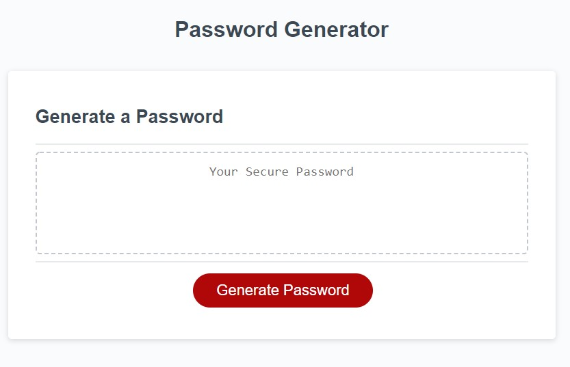

# hw-03-javaScript-password-generator
Homework 3, Password Generator
### Overview:
This is homework required for the University of Denver Coding Boot Camp.  The assignment was to write javascript to create a password generator.
Criteria:
1. prompt for the length of password (between 8 and 128).
2. user can choose if they want lowercase, uppercase, numeric and special characters. 

#### Code: 
The website is built with HTML, CSS and Javascript. 
1. HTML and CSS files were provided. 
2. Javascript - a few lines of code were provided and we were required to write the rest of the code to generate the random password. 

#### Links:

- [Link to the password generator](https://markraud.github.io/hw-03-javascript-password-generator/).

- [Link to GitHub Repository](https://github.com/markraud/hw-03-javascript-password-generator).

#### Screenshot:

#### Contact Info:
Built by Mark Raudenbush
markraud@hotmail.com
- [My LinkedIn](https://www.linkedin.com/in/markraudenbush)
- [My GitHub](https://github.com/markraud)

#### License:
The MIT License (MIT)

#### Summary:

I enjoyed this project and look forward to learning more javascript. 

